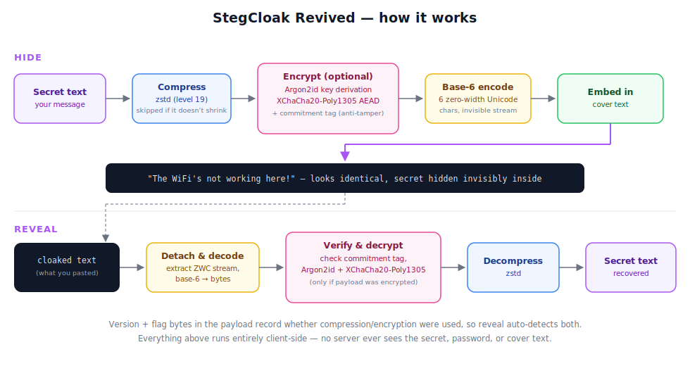

<h1 align="center">
  <br>
  
  <br>
  <br>
  <span>StegCloak Revived</span>
  <br>
  
  
  <br>
</h1>
<h4 align="center">The Cloak of Invisibility for your texts — rebuilt from the ground up</h4>

<p align="justify">
StegCloak hides secrets inside ordinary-looking text by compressing and encrypting the secret, then cloaking it with invisible Unicode zero-width characters. Paste the result into a tweet, an email, a chat message, anywhere — it reads as normal text, but carries a hidden, encrypted payload only the intended recipient can reveal.
</p>

<br>

## About this fork

**StegCloak Revived** is a maintenance fork of the original [StegCloak](https://github.com/KuroLabs/stegcloak) by KuroLabs, which has been unmaintained for some time. This project keeps the core idea alive, brings the codebase into TypeScript, and replaces the aging cryptography and compression with modern, audited primitives. It is not a from-scratch rewrite — it's a revival.

- Original project: [github.com/KuroLabs/stegcloak](https://github.com/KuroLabs/stegcloak)
- This fork: [github.com/cryptic-noodle/stegcloak-revived](https://github.com/cryptic-noodle/stegcloak-revived)
- Live web app: **[stegcloak-revived.vercel.app](https://stegcloak-revived.vercel.app/)**

## Highlights

- 📴 **Offline-first PWA** — the web app is a fully installable Progressive Web App. Install it on Android, iOS, or desktop (Chrome/Firefox) and it works with no network connection at all; every encode/decode happens locally in your browser.
- 🔐 **Way better security** — the old AES-256-CTR + custom HMAC scheme is gone. Encryption is now **Argon2id** for password-based key derivation, **XChaCha20-Poly1305** (via libsodium) for authenticated encryption, and a dedicated commitment tag to guard against tampering.
- 📉 **Smaller output for large inputs** — switching compression to **zstd** and re-encoding the hidden stream in **base-6** (instead of the original binary scheme) produces a noticeably shorter invisible-character payload than the original StegCloak when hiding larger secrets, while remaining fully invisible.
- 🧩 **Modern monorepo** — the crypto/compression/encoding core lives in its own TypeScript package (`@stegcloak/core`), shared by both the CLI and the web app.

## How it works



At a high level: the secret is compressed (zstd), optionally encrypted (Argon2id-derived keys + XChaCha20-Poly1305), encoded into a stream of 6 invisible zero-width Unicode characters (base-6), and stitched invisibly between the words of your cover text.

## Project layout

```
stegcloak-revived/
├── packages/core/   # @stegcloak/core — crypto, compression, encoding (TypeScript)
├── webapp/          # React + Vite PWA — the web app behind stegcloak-webapp.vercel.app
├── cli.js           # Command-line interface
└── stegcloak.js     # Node/CLI-facing wrapper around @stegcloak/core
```

## Installing

Using npm, as a global CLI tool:

```bash
$ npm install -g stegcloak
```

Using npm, to use it as a library in your own project:

```bash
$ npm install stegcloak
```

## CLI Usage

### Hide

```bash
$ stegcloak hide
```
Options:

```
  hide [options] [secret] [cover]

  -fc, --fcover <file>      Extract cover text from file
  -fs, --fsecret <file>     Extract secret text from file
  -n, --nocrypt             If you don't need encryption (default: false)
  -i, --integrity           If additional security of preventing tampering is needed (default: false)
  -o, --output <output>     Stream the results to an output file
  -c, --config <file>       Config file
  -h, --help                display help for command
```

### Reveal

```bash
$ stegcloak reveal
```
Options:

```
  reveal [message]

  -f, --file <file>       Extract message from file
  -cp, --clip             Copy message directly from clipboard
  -o, --output <output>   Stream the secret to an output file
  -c, --config <file>     Config file
  -h, --help              display help for command
```

### Additional support

- **STEGCLOAK_PASSWORD** environment variable, if set, will be used by default as password.
- **Configuration file** support to configure the CLI and skip prompts — see `config-samples/` for example `hide-config.json` / `reveal-config.json` files.

## API Usage

```javascript
import { hide, reveal } from "@stegcloak/core";

const magic = await hide({
  secret: "Voldemort is back",
  cover: "The WiFi's not working here!",
  password: "mischief managed",
});

console.log(magic); // The WiFi's not working here!

const secret = await reveal({ text: magic, password: "mischief managed" });

console.log(secret); // Voldemort is back
```

Compression and encryption flags are stored in the hidden payload itself, so `reveal` automatically detects what was done during `hide` and acts accordingly. If you don't pass a `password` to `hide`, the payload is compressed but not encrypted.

## Important

<p align='justify'>
StegCloak doesn't solve the Alice-Bob-Warden problem — it's powerful only when nobody is specifically looking for it, and it does that really well thanks to its invisible characters. It's great for watermarking, invisible tweets, social media, and similar low-suspicion channels. Don't rely on it against an adversary who is actively inspecting your text for unusual invisible Unicode characters: while the hidden secret itself stays encrypted, the presence of a hidden payload could still be detected by that kind of analysis.
</p>

## Contributing

Pull requests are welcome. For major changes, please open an issue first to discuss what you would like to change.

## License

[MIT](LICENSE) — this project is a fork of [StegCloak](https://github.com/KuroLabs/stegcloak) by Kandavel A, Mohanasundar M, and Sujin LK. See the [LICENSE](LICENSE) file for full copyright details.

## Acknowledgements

The StegCloak concept and original implementation are by [KuroLabs](https://github.com/KuroLabs). The StegCloak logo was designed by [Smashicons](https://www.flaticon.com/authors/smashicons).
